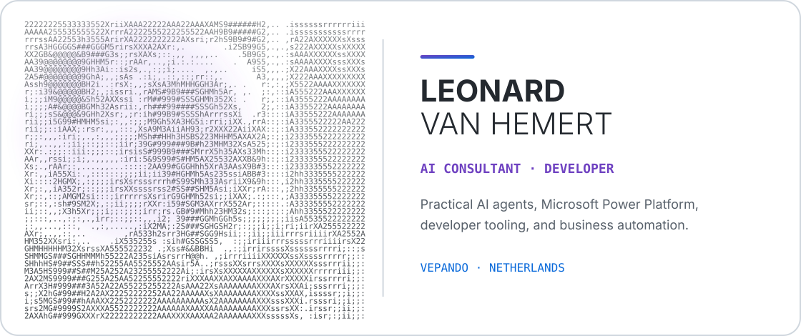

<!--
  Structure inspired by GitSkins and profile-readme-generator:
  identity -> focus -> proof -> contributions -> next step.
  Theme switching follows GitHub's documented <picture> pattern.
-->

<picture>
  <source media="(prefers-color-scheme: dark)" srcset="./assets/ascii-hero-dark.svg">
  <source media="(prefers-color-scheme: light)" srcset="./assets/ascii-hero-light.svg">
  
</picture>

# Leonard van Hemert — AI Consultant & Developer

I build practical **AI agents**, **Microsoft Power Platform solutions**, developer tools, and business automations at [VEPANDO](https://vepando.com). My work connects AI-assisted software development with production systems: Power Apps Code Apps, Dataverse, Power Automate, n8n, MCP servers, APIs, and secure self-hosted services.

## What I build

- **Microsoft Power Platform** — Power Apps Code Apps, Dataverse, Power Automate, reusable skills, and safe delivery workflows.
- **AI developer tooling** — portable agent skills and integrations for Codex, Claude Code, GPT models, and MCP-compatible tools.
- **Automation and infrastructure** — n8n workflows, APIs, Azure services, containerized applications, and self-hosted AI systems.
- **Open-source products and research** — TypeScript, React, Python, Swift, reproducible mathematics, and auditable research artifacts.

## Technology focus

## Pinned repositories

<!-- PINNED-REPOS:START -->
_Automatically synced with the repositories pinned on my GitHub profile._

| Repository | Description |
|---|---|
| [`decision-council`](https://github.com/LeonardSEO/decision-council) | Structured multi-persona AI decision council skill — one defensible recommendation from independent expert personas, adversarial review, and evidence-weighted synthesis |
| [`liquid-glass-react`](https://github.com/LeonardSEO/liquid-glass-react) | Real Apple-style "Liquid Glass" edge refraction for React/Next.js using a single SVG feDisplacementMap filter — no WebGL, no canvas, ~5KB |
| [`chatgpt-gemini-like-tone`](https://github.com/LeonardSEO/chatgpt-gemini-like-tone) | Gemini-like ChatGPT tone via Custom Instructions (V1) |
| [`power-apps-code-apps-skill`](https://github.com/LeonardSEO/power-apps-code-apps-skill) | Cross-compatible skill for vibecoding Power Apps Code Apps with Codex and Claude Code. |
| [`power-platform-skills-codex`](https://github.com/LeonardSEO/power-platform-skills-codex) | Unofficial Codex adaptation of Microsoft Power Platform Skills with telemetry hard-disabled and automated upstream sync. |
<!-- PINNED-REPOS:END -->

## GitHub contributions

<picture>
  <source media="(prefers-color-scheme: dark)" srcset="https://www.gitskins.com/api/section/stats?username=LeonardSEO&amp;theme=github-dark&amp;style=aura">
  <source media="(prefers-color-scheme: light)" srcset="https://www.gitskins.com/api/section/stats?username=LeonardSEO&amp;theme=zen&amp;style=aura">
  
</picture>

<picture>
  <source media="(prefers-color-scheme: dark)" srcset="https://www.gitskins.com/api/section/heatmap?username=LeonardSEO&amp;theme=github-dark&amp;style=aura">
  <source media="(prefers-color-scheme: light)" srcset="https://www.gitskins.com/api/section/heatmap?username=LeonardSEO&amp;theme=zen&amp;style=aura">
  
</picture>

[View my complete contribution calendar and activity on GitHub →](https://github.com/LeonardSEO?tab=overview)

## Current focus

- Making Microsoft Power Platform development more reliable for AI coding agents.
- Building production-ready AI agents and workflow automations for Dutch businesses.
- Publishing open-source developer tools with clear security, reproducibility, and deployment boundaries.
- Continuing reproducible research around semilocal zeta operators and spectral methods.

## Work with me

I'm open to practical AI, Power Platform, automation, and developer-tooling collaborations.

- Portfolio: [leonardseo.github.io](https://leonardseo.github.io/)
- Company website: [vepando.com](https://vepando.com)
- LinkedIn: [Leonard van Hemert](https://www.linkedin.com/in/leonard-van-hemert/)
- GitHub: [@LeonardSEO](https://github.com/LeonardSEO)
